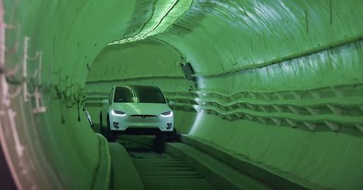
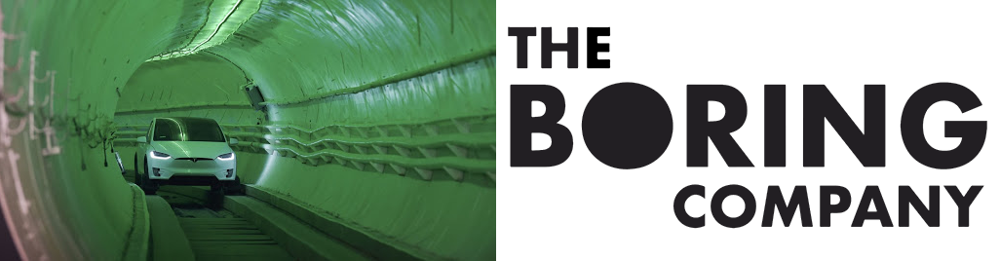
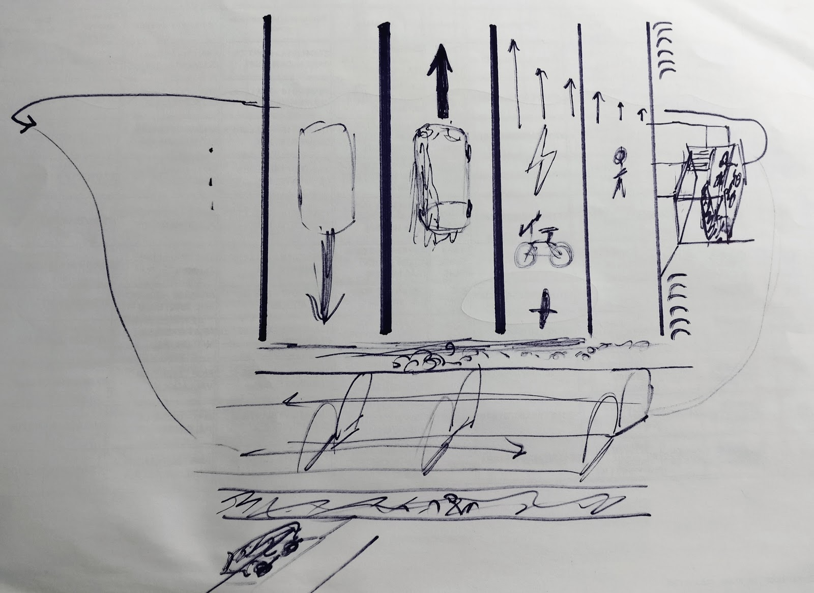

# Why live in Megacities?
I think that most people want services nearby, want the places where they work close the their homes, see other people nearby, as well as leisure centers and places where you can do various activities, while not spending much time and resources to transport yourself. We want public transportation, walkability, attractions, restaurants, malls, medical care, parks...

As a business you don't want to transport your products long distances. As an individual, in order to be able to trade products you would like to have as many people as possible near you. It's more efficient to share the resources instead of building everything from scratch now and again. It's more efficient to have a road, a train, or a scooter sharing company if a lot of people will use it.

We are [7.7 billion people](http://www.worldometers.info/world-population/), and the earth shouldn't be just for housing one mediocre city after another one. I think we should plan a big gorgeous city, choose a good place, and build it, rather than expanding chaotically our current cities.

# How to do it? Main problems
* Resources (water, electricity (and its many sources), internet)
* Transportation
* Living environment
* Emergencies (Problems with resources or 	transportation)
* Services (Firefighters, police...)
* Illumination with sunlight of all buildings

## Resources
World’s more wasteful megacity, NY.
https://motherboard.vice.com/en_us/article/kbz59z/the-worlds-most-wasteful-megacity
...
### Water
### Electricity
## Transportation of people
First we should have a good train system to transport massive amounts of people, and we could tunnel lanes for cars and train rails. The Boring Company is achieving to bore at a much lower cost than traditional companies, letting us grow our cities in the z direction, but not only upwards. The cars/buses/autonomous taxis would go underground. The outside roads would be left for bikes, pedestrians, etc.

For short distances around the city, a large asphalt road with separations between the fastest and the slowest vehicles and pedestrians, or continuous separation from slow to fast. (From center to the sides: Lanes without speed limit, vehicle lanes, electric bike/scooter/unicycle/solowheel lanes, slower bike/scooter/skateboard/people-running lanes, then space for pedestrians, and then benches, WC and some services).

The road is clearly separated in two directions, with the fastest vehicles near the center of the road and the slowest at the sides, connected with the surroundings. With this disposition is easy to enter a lane and go to the fast part of it, accelerating while going left, but is more slow to change of direction. The logic is that you won’t usually want to change of direction, and if you do, you will have to slow down first, so this shouldn’t be a problem. This makes the destinations accessible easily to everyone, independently of their speed. 

If the road has large vehicles (trucks for transporting products), those vehicles would be completely separated from the rest of the lanes, near the center of the road, and would have vertical parking slots with supercharging built-in, places to stop temporarily near the city, and underground parking and washing/charging/repairing services. The changes of direction formed by tunnels, bridges, or if there isn’t other option, crosswalk that allows to change direction to all vehicles (for cars). Few large roads. High skyscrapers and parks/etc. separating them.

Could we use covered lanes? https://en.wikipedia.org/wiki/SkyCycle_(proposed_transport_project)

------------------------
Que la megaciudad tenga un sistema de transporte público con grandes trenes, capaces de transportar a la totalidad de la población, aunque sea de forma incómoda. Cuando lo usa poca gente, que sea un medio de transporte muy cómodo y donde se pueda aprovechar el tiempo. La mayoría de los transportes en bicis/patinetes/monopatines/uniciclos eléctricos a través de carriles en las vías de la ciudad que ya dibujé.
También la posibilidad de crear tubos donde se aloje la calzada para bicis/patinetes/monopatines/uniciclos, aislada del tiempo exterior. Así la calzada y los vehículos de degradarían menos, y sería cómodo viajar en vehículos menores que nosotros aunque esté lloviendo.
Cada tubo tendría un único sentido, y posiblemente estaría a una inclinación constante, para no tener que consumir energía y poder utilizar vehículos sin motor o no gastar la batería en los que sí tienen motor. sobre/entre los edificios, o bajo tierra. Al viajar todos en el mismo sentido el rozamiento del aire debería ser menor ya que todas estas personas transportándose acabarían creando algo de viento en el interior. También túneles donde viajen coches eléctricos/autónomos cuyo servicio pueda ser alquilado, o con coches privados. Obviamente aparcamiento para los coches privados bajo tierra, con las salidas para sus usuarios junto a las salidas de los trenes convencionales, también junto a los parking de bicis/patinetes/monopatines/uniciclos privados y alquilados.

## Transportation of resources
## Living environment
Buildings with plants: https://www.dezeen.com/2017/06/30/10-plant-covered-buildings-point-greener-future-living-walls-roundup/
Techniques for planting in the buildings, so that we can grow plants and gather them (if we didn’t do that we wouldn’t be absorbing CO2) letting them grow more and more. We can absorb pollution, CO2, NOx?, Increase humidity and make a healthier psychological environment for people. Combine glass (let all the light pass into the building), with plants and solar panels.

---- idea malla metálica con una cuchilla para cortar periódicamente las plantas hidro-aeropónicas

## Data about megacities
### The biggest current megacities
* Tokio
* Jakarta
* Delhi
* Manila	
* New York
#### The biggest future megacities (predicted)
* Chicago
* Bogotá
* Luanda
* Chennai
* Baghdad
* Dar es Salaam
#### Tokio
Japan Capital 36 million inhabitants
#### Jakarta
Indonesia capital 30 million inhabitants
#### Delhi
India capital 25 million inhabitants
#### Manila
Philippines Capital 24 million inhabitants.
#### New York City
20 million inhabitants.

# Bibliography
* https://www.visualcapitalist.com/mapping-the-worlds-new-megacities-in-2030/
* https://www.fastcompany.com/3037697/a-plant-covered-car-free-design-for-the-megacity-of-the-future
* http://global.ctbuh.org/resources/papers/download/3287-megacities-design-challenges-and-responses.pdf
* http://webs.schule.at/website/Megacities/problems_en.htm
* https://www.forbes.com/sites/megacities/2011/04/04/the-problem-with-megacities/
* https://flipboard.com/@contextlink/megacities-gam0sv8vz
* https://inhabitat.com/bosco-verticale-in-milan-will-be-the-worlds-first-vertical-forest/
* http://www.igreenspot.com/the-green-building-of-national-life-insurance-by-henry-browne-and-borja-huidobro/
* https://flipboard.com/@contextlink/megacities-gam0sv8vz
* https://motherboard.vice.com/en_us/article/kbz59z/the-worlds-most-wasteful-megacity
* https://www.fastcompany.com/90234563/were-designing-bike-lanes-wrong
* https://www.chinadialogue.net/article/show/single/en/8889-Lessons-for-a-cycling-megacity-
* https://www.bikeradar.com/commuting/news/article/could-overhead-cycle-lanes-be-future-of-london-commuting-35369/
* https://en.wikipedia.org/wiki/SkyCycle_(proposed_transport_project)
* https://lloydalter.typepad.com/lloydalter/2009/03/building-a-better-bike-lane.html
